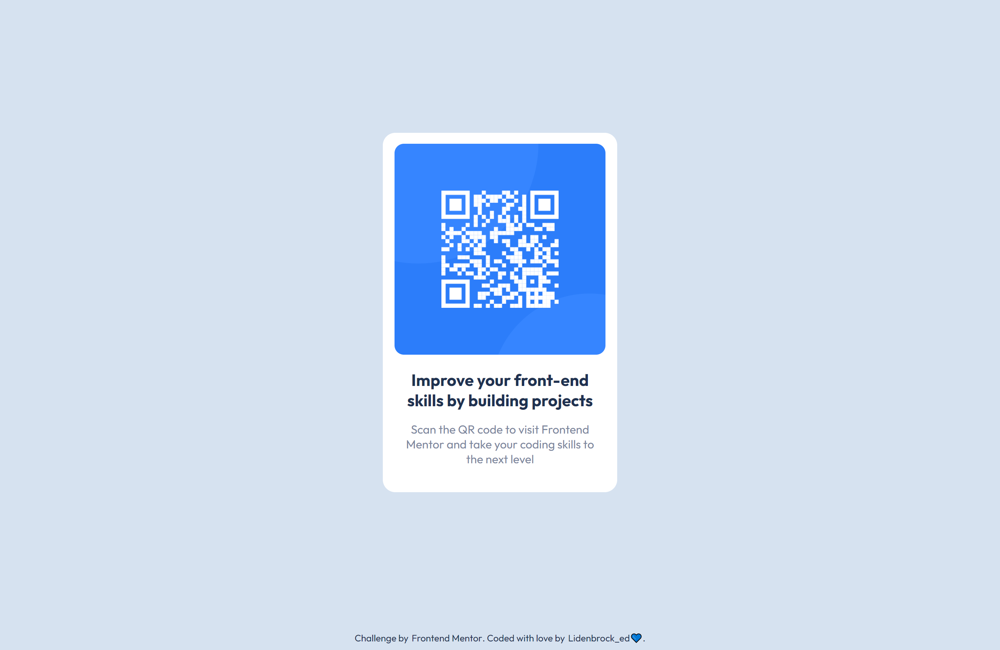

# Frontend Mentor - QR code component solution

This is a solution to the [QR code component challenge on Frontend Mentor](https://www.frontendmentor.io/challenges/qr-code-component-iux_sIO_H). 
Frontend Mentor challenges help you improve your coding skills by building realistic projects.

## Table of contents

- [Overview](#overview)
  - [The challenge](#the-challenge)
  - [Screenshot](#screenshot)
  - [Links](#links)
- [My process](#my-process)
  - [Built with](#built-with)
- [Author](#author)

## Overview

### The challenge

Users should be able to:

- View the optimal layout for the interface depending on their device's screen size
- See hover and focus states for all interactive elements on the page

### Screenshot

| Desktop                              | Mobile                              |
| :-----------------------------------:| :---------------------------------: |
| | |

### Links

- Solution URL: [Repository](https://github.com/Lidenbrock-ed/qr-code-component-main)
- Live Site URL: [Product Preview Card Component Page](https://lidenbrock-ed.github.io/qr-code-component-main/)

## My process

### Built with

- Semantic HTML5 markup
- CSS custom properties
- Flexbox
- Mobile-first workflow

## Author

- Frontend Mentor - [@Lidenbrock-ed](https://www.frontendmentor.io/profile/Lidenbrock-ed)
- Twitter - [@Lidenbrock_Ed](https://twitter.com/Lidenbrock_Ed)
